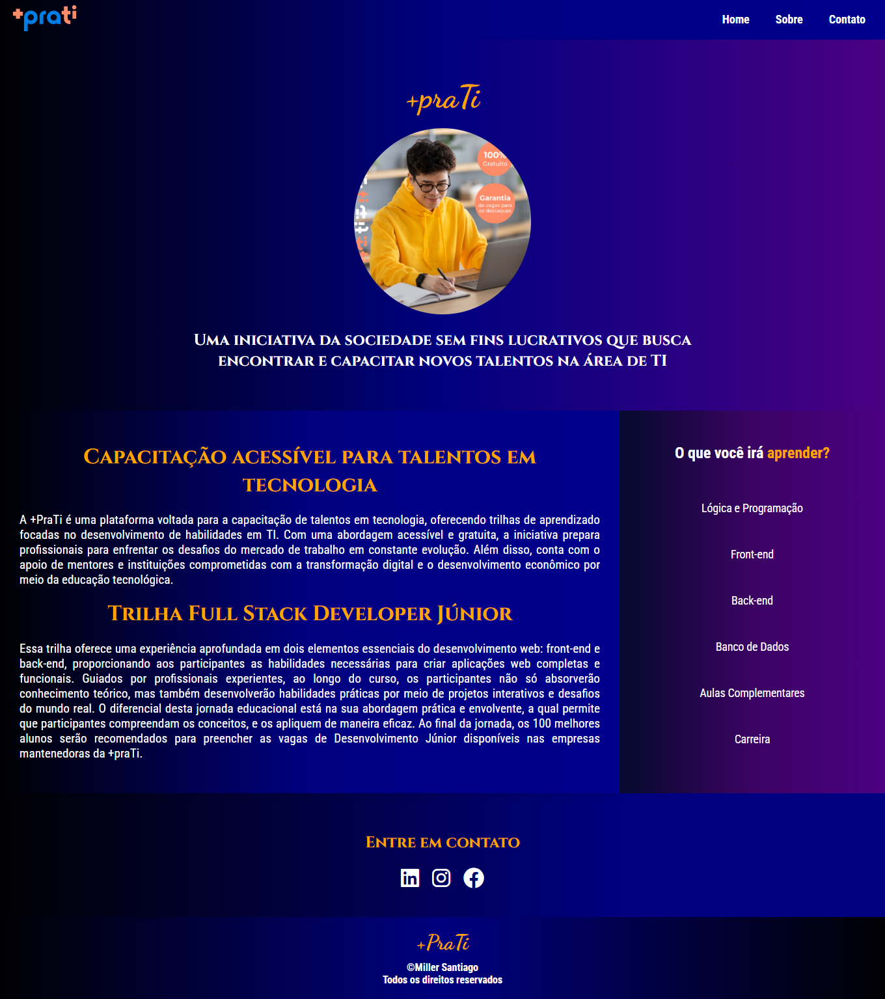

<h1>Atividade 3: Criando uma Página Web Simples</h1>

<h2>Objetivo: Desenvolver uma página web utilizando HTML e CSS que contenha os principais elementos de uma estrutura de site.</h4>

<h3>Instruções:</h3>

<strong>Estrutura da Página:</strong>
- Crie uma página web com um header, section, aside e footer.
- O header deve conter o título do site e um menu de navegação simples com 3 links fictícios (ex.: Home, Sobre, Contato).
- O section será a área principal do conteúdo, com um parágrafo explicando sobre o site.
- O aside deve conter uma lista de links externos relacionados ao tema do site.
- O footer deve incluir informações de direitos autorais.

<strong>Estilização com CSS:</strong>
- Aplique cores ao fundo do header, section, aside e footer.
- Centralize o texto no header e no footer.
- Utilize uma fonte personalizada (ex.: Google Fonts) para o texto do section.
- Crie um layout com duas colunas: o section à esquerda e o aside à direita, ocupando 70% e 30% da largura da tela, respectivamente.
- Adicione um efeito hover para os links do menu de navegação e os do aside (ex.: mudar de cor quando passar o mouse).

<strong>Requisitos Mínimos:</strong>
- Utilizar ao menos uma imagem no section com o atributo alt preenchido corretamente.
- Os links no menu de navegação e no aside devem ser clicáveis (mesmo que levem a páginas fictícias).

<h4>Link para deploy: https://miller110.github.io/MaisPraTi/Atividade03/</h4>

