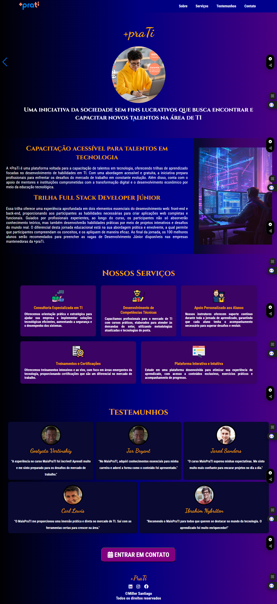

# +PraTi - Atividade 4 

## Instruções

## Estrutura da Página

### Header
- Crie um cabeçalho com o logo da empresa e um menu de navegação com links para seções como "Sobre", "Serviços", "Testemunhos" e "Contato".
- Inclua uma chamada para ação (CTA), como "Entre em Contato" ou "Assine Agora".

### Banner Principal
- Utilize um slider/carrossel para exibir imagens ou conteúdo sobre os principais serviços/produtos oferecidos pela empresa.
- Esse slider deve ter navegação com botões de avançar/retroceder e indicadores (círculos ou barras) para cada slide.
- Utilize uma biblioteca externa como Swiper.js ou Slick Slider para implementar o slider.

### Seção "Sobre"
- Crie uma breve seção apresentando a empresa ou o produto, com um título e parágrafo descritivo.

### Seção "Serviços"
- Utilize cards ou ícones para descrever os principais serviços ou características do produto.
- Consuma uma API externa para popular essa seção. Por exemplo, utilize uma API para carregar os dados de serviços disponíveis ou de depoimentos.

### Seção "Testemunhos"
- Crie uma área para exibir depoimentos de clientes satisfeitos. Os depoimentos podem ser estáticos ou dinâmicos, consumindo uma API de comentários.
- Cada depoimento deve incluir nome, foto do cliente e o texto do depoimento.
- Utilize uma biblioteca de animações como AOS.js para animar a exibição dos testemunhos quando o usuário rolar a página.

### Seção "Contato"
- Adicione um formulário de contato com campos para nome, email, telefone e mensagem.
- Valide o formulário com JavaScript, garantindo que todos os campos obrigatórios sejam preenchidos corretamente.
- Integre o formulário com um serviço de API (ex.: EmailJS) para enviar os dados do formulário para um email.

### Footer
- O rodapé deve conter links para as redes sociais da empresa, além de informações como termos de uso e política de privacidade.

## Estilização com CSS

### Design Responsivo
A página deve se adaptar a diferentes dispositivos (desktop, tablet, smartphone) usando media queries ou um framework CSS como Bootstrap ou Tailwind CSS.

### Slider
- Estilize o slider com transições suaves entre as imagens ou seções. 
- Use CSS para personalizar os botões de navegação e os indicadores.

### Seção de Testemunhos
Aplique animações para que os testemunhos apareçam gradualmente conforme o usuário rola a página.

### Botões CTA (Call to Action)
Os botões de ação, como "Assine Agora" ou "Saiba Mais", devem ter um efeito de hover, como mudança de cor e tamanho ao passar o mouse.

## Requisitos JavaScript

### Consumo de APIs
Implemente o consumo de uma API externa para a seção de serviços e/ou depoimentos, utilizando `fetch()` para carregar dinamicamente os dados.

### Validação de Formulário
Adicione validações para garantir que os campos obrigatórios no formulário de contato sejam preenchidos corretamente.

### Slider Interativo
Utilize uma biblioteca externa para o slider, implementando navegação fluida e interatividade no carrossel de imagens.

### Tratamento de Erros
Trate possíveis erros na chamada de API com mensagens apropriadas, como "Erro ao carregar os serviços" ou "Erro ao enviar a mensagem".

## Bibliotecas Externas Recomendadas
- **Swiper.js** ou **Slick Slider** (para o carrossel/slider).
- **AOS.js** (para animações ao rolar a página).
- **Bootstrap** ou **Tailwind CSS** (para design responsivo e componentes prontos).
- **EmailJS** (para envio de emails diretamente pelo formulário de contato).

## Link de Entrega
- Submeta o link do repositório GitHub.
- Um arquivo `README.md` com instruções de como visualizar o projeto localmente, informações sobre as APIs utilizadas, e uma breve explicação das bibliotecas externas aplicadas no projeto.

## Critérios de Avaliação
- **Funcionalidade**: A página deve estar funcional, com o slider, consumo de API e formulário operando corretamente.
- **Responsividade**: O design deve se adaptar bem a dispositivos móveis e desktops.
- **Estilização e Layout**: A página deve estar visualmente atraente, com uma boa disposição dos elementos e uso apropriado de CSS.
- **Uso de Bibliotecas Externas**: Avaliação do uso adequado de bibliotecas recomendadas e sua implementação correta.
- **Acessibilidade e Semântica**: Verificar se foram seguidas as boas práticas de acessibilidade e uso de tags semânticas no HTML.

## Resolução

#### Deploy: https://maisprati.vercel.app/#title

<video width="640" height="360" controls autoplay loop muted>
    <source src ="./video/+PraTi.mp4" type="video/mp4">
</video>

#### O projeto apresentado foi inspirado no site oficial do +PraTi, uma plataforma voltada para a capacitação de novos talentos na área de tecnologia da informação (TI). Seu objetivo central é oferecer trilhas de aprendizado acessíveis e gratuitas, focando no desenvolvimento de habilidades práticas. No meu projeto, dediquei especial atenção ao curso intensivo para desenvolvedores Full Stack, que integra conhecimentos de front-end e back-end, capacitando os alunos a criar aplicações web completas.
#### Durante o desenvolvimento desse projeto, diversas tecnologias e práticas foram aplicadas, incluindo HTML, CSS e JavaScript. Utilizei bibliotecas como Swiper para implementar carrosséis interativos e AOS (Animate On Scroll) para criar animações durante o rolar da página. O design conta com ícones do Font Awesome e uma variedade de fontes do Google Fonts, resultando em uma estética moderna e atraente. A responsividade foi uma prioridade, garantindo que a página funcione perfeitamente em dispositivos móveis e desktops. Além disso, a integração com a API do EmailJS possibilita o envio de mensagens, promovendo assim uma comunicação eficiente. Por fim, implementei a API randomuser para gerar fotos e nomes de usuários aleatórios em um arquivo chamado person.js. E para enriquecer a experiência, adicionei comentários diretamente no código JavaScript, que são exibidos junto com a foto e o nome de cada usuário. 

