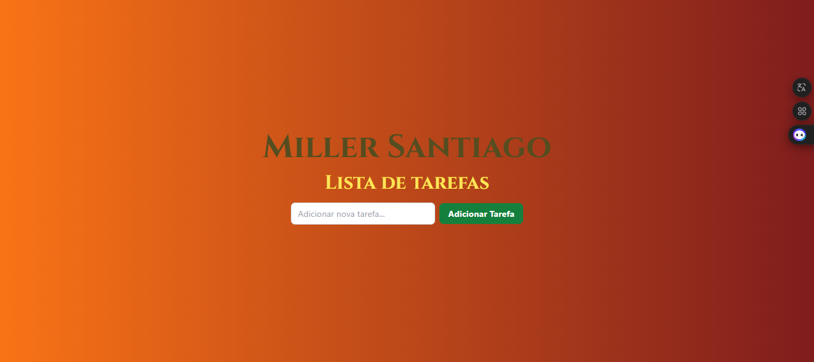

# Objetivo

Desenvolva uma aplicação simples de lista de tarefas (todoApp) utilizando HTML, CSS (Bootstrap/Tailwind) e JavaScript, com armazenamento de dados no `localStorage`. O projeto deve permitir a criação, leitura, edição e exclusão de tarefas, além de persistir as informações no `localStorage`, para que elas não sejam perdidas ao recarregar a página.

## Requisitos

### Estrutura do Aplicativo:
- Crie uma interface onde o usuário possa adicionar tarefas através de um campo de texto e um botão de registro.
- Cada tarefa adicionada deve ser exibida em uma lista visível na página.

### Funcionalidades CRUD:
- **Create (Criar)**: O usuário deve ser capaz de adicionar novas tarefas à lista.
- **Read (Ler)**: As tarefas devem ser carregadas automaticamente a partir do `localStorage` ao abrir a aplicação.
- **Update (Atualizar)**: Cada tarefa deve ter a opção de ser editada. Ao clicar em "Editar", o texto da tarefa pode ser alterado.
- **Delete (Excluir)**: Cada tarefa deve ter a opção de ser excluída, removendo-a da lista e do `localStorage`.

### Persistência de Dados:
- Utilize o `localStorage` para salvar as tarefas. As tarefas devem persistir mesmo após o fechamento ou recarregamento da página.

### Estilização:
- Utilize Tailwind ou Bootstrap CSS para estilizar a aplicação, garantindo uma aparência limpa e moderna.
- Estilize os botões de edição e exclusão, além da lista de tarefas, para uma melhor experiência visual.
- Aplique classes da biblioteca do seu gosto para garantir responsividade e estética.

### Funcionalidade Extra (Opcional):
- Adicione a capacidade de marcar uma tarefa como "concluída", aplicando uma estilização diferenciada para indicar o status de conclusão.

## Modo de Entrega
Envie o código-fonte completo da aplicação (HTML, CSS e JavaScript) em um repositório no GitHub. Certifique-se de incluir um `README.md` explicando como o projeto foi desenvolvido, como executá-lo e as principais funcionalidades implementadas.

## Critérios de Avaliação:
- **Funcionalidade Completa**: A aplicação deve permitir realizar todas as operações CRUD (Criar, Ler, Editar, Excluir).
- **Persistência dos Dados**: As tarefas devem ser salvas no `localStorage` e carregadas automaticamente ao recarregar a página.
- **Interface Usuário (UI)**: O aplicativo deve ser visualmente agradável e fácil de usar, utilizando Tailwind ou Bootstrap.
- **Código**: Estrutura do código, boas práticas de organização e clareza nos comentários.

---
## Resolução
**Deploy:https://atividade5-two.vercel.app/**

- **Lista de Tarefas**

- **Tarefa Adicionada**

- **Tarefa Concluída**

- **Editar Tarefa**

- **Tarefa Editada**

- **Tarefa Excluída**

 
**Esta página de lista de tarefas permite ao usuário adicionar, ler, editar, concluir e excluir tarefas. A página tem um design agradável com cores e fontes estilizadas. Quando você digita uma tarefa no campo de texto e clica no botão "Adicionar Tarefa", ela aparece na lista. Você pode marcar uma tarefa como concluída, editar seu texto ou excluí-la. Além disso, as tarefas são salvas no navegador para que o usuário não perca as alterações ao recarregar a página.**

**A responsividade da página garante que ela se ajuste bem a diferentes tamanhos de tela. Em dispositivos móveis, os elementos ficam mais compactos e ocupam a largura total da tela. Em tablets e computadores, o layout se expande e os textos e botões ficam maiores, melhorando a experiência do usuário em telas maiores. Isso é feito usando regras de estilo específicas para diferentes tamanhos de tela, garantindo que a página seja fácil de usar em qualquer dispositivo.**
