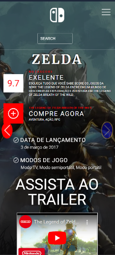

# Atividade 6 - Correções em Landing Page

## Descrição
Este projeto tem como objetivo aprimorar a landing page já existente no repositório [maisPraTi-2024-02](https://github.com/jhyago/maisPraTi-2024-02/tree/main/2-html-css-js/6-landing-page), implementando as seguintes **melhorias e funcionalidades ↓**

###### Implementação de Modais
Adicionar modais interativos para exibir informações adicionais sobre os jogos ou serviços da página. Esses modais devem ser acionados por botões ou elementos clicáveis e devem conter conteúdo relevante, como:
- Formulários
- Descrições detalhadas
- Opções de compra

###### Novo Slide com Link (Zelda)
Incluir um novo slide na seção de carrossel utilizando imagens fornecidas pelo professor. Esse slide deve conter informações sobre um novo jogo ou serviço e incluir um botão que leva a um link externo relevante.

######  Melhoria na Responsividade
A página deve ser completamente responsiva, garantindo que o layout se ajuste adequadamente em diferentes tamanhos de tela (mobile, tablet, desktop). Ajustar os elementos como:
- Imagens
- Textos
- Botões  

Para melhorar a experiência do usuário em dispositivos móveis.

######  Aprimoramento de Semântica HTML
Substituir e/ou complementar as tags HTML utilizadas com elementos semânticos adequados (`<header>`, `<section>`, `<article>`, `<footer>`, etc.) para garantir a acessibilidade e melhorar o SEO da página.

######  Criação de Ícones Personalizados
Desenvolver ou integrar ícones personalizados para botões e navegação. Esses ícones devem melhorar a usabilidade e a aparência da interface. Considere usar:
- Fontes de ícones como Font Awesome
- Ícones SVG personalizados

######  Fontes Customizadas
Adicionar fontes personalizadas para melhorar a estética visual da página. Use fontes modernas e compatíveis com o tema da landing page, como as disponíveis no [Google Fonts](https://fonts.google.com).

###### Testes e Validação
Testar a página em diferentes navegadores e dispositivos para garantir que todas as funcionalidades estejam funcionando conforme esperado, incluindo:
- Carrossel
- Modais
- Links
- Responsividade
---
##### Desktop

##### Responsividade

  
  
  

##### Modal

